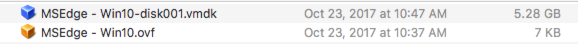
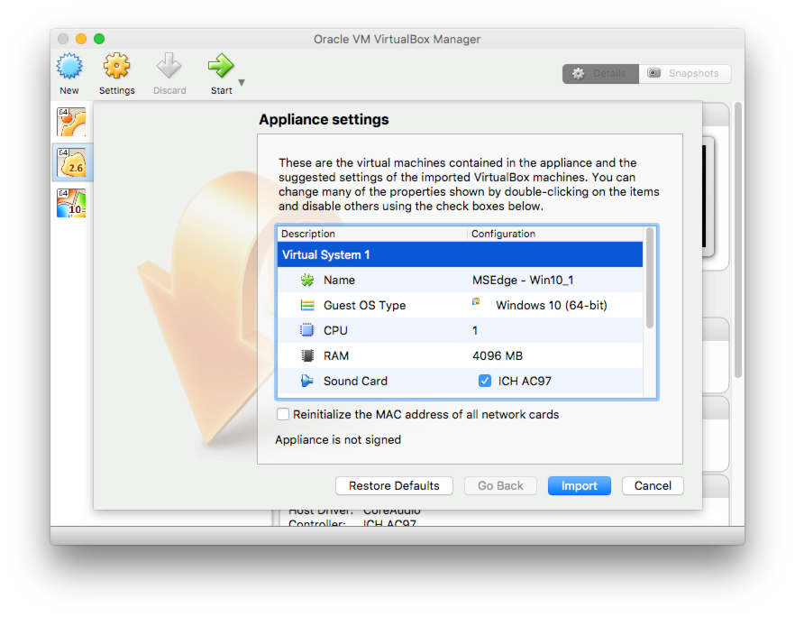
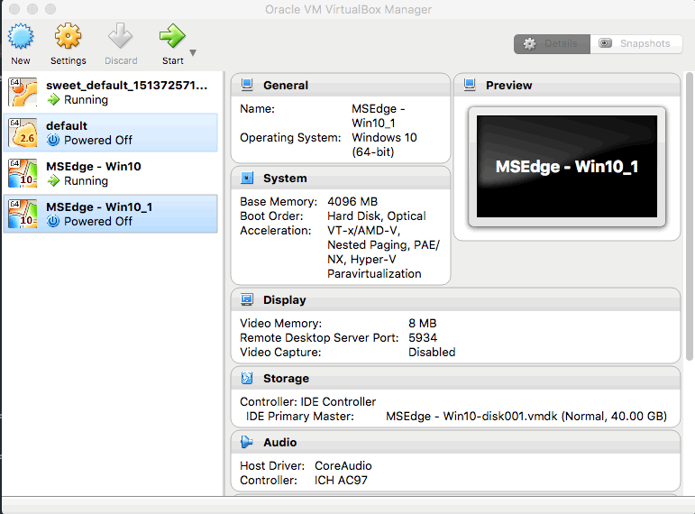

I'm finding myself in a situation where I am unable to reproduce an issue QA has found with a form validation on a file upload.  After going thru tests in our CI environments as well as our QA and my personal local environment I figured it must be because they are testing on Windows... womp womp.  Anyways, the form validation is pretty straight forward.  It is a file upload and strictly uploads a file.  It is supposed to only accept.csv files, so there is a listener for that element when a file is attached, it checks the file name and confirms its a filetype CSV (well, by extension that is :P).  This means I'm going to need to set up a Windows environment on my Mac which I have done a few times before, but figured since I have to start the process over again I'd use this blog post as a form of documenting how I did it and perhaps I (or even you!) can reference it in the future to make it an easier process.... Think of this as a Dockerfile for getting a quick Windows environment for testing!  Hurray! Lets get started.

#Requirements

- [Virtual Box](https://www.virtualbox.org/wiki/Downloads)
- [Virtual machine image](https://developer.microsoft.com/en-us/microsoft-edge/tools/vms/)

##Steps
We are going to want to install box virtual box and download a virtual machine image of Windows.  Keep in mind you can also install chrome on these virtual images.  So while their selections might only be for various Internet Explorer/Edge versions, you still get a Windows virtual machine... which in this case is exactly what we want!  

One virtual box is installed and the image is downloaded, unzip the image and you'll be presented with two files.  One small, one about 5 gigs.  



The larger is the two files is the actual image while the smaller .ovf file is what virtual box needs to basically map settings and pointers to the larger image file.  All I did was double click the .ovf file and virtual box recognizes the extension and handles the mapping from there, all you have to do is confirm you want to import it.  The defaults should be fine.



Give that a bit to import... it is 5 gigs so be patient.  Even on my Macbook pro it took about 3-4 minutes.  I guess thats a good hint I need some more coffee.  

##Starting Windows

At this point, your import should be finished.  Congrats!  That wasn't too bad yea?  All we need to do is boot up Windows.  It's so easy I'll just provide you with a gif as an example - 


Thats it!  Now you've got windows up and running on your Mac making it far easier to test weird Windows/internet explorer bugs during the development process.  

#Important Note:
If you are trying to access a local development environment you have running on your host machine (OSX being the 'host' in this case since it spawned the virtual windows machine) you'll need to target your hostmachines IP.  

The default IP for your host is **10.0.2.2**

So for example if you are wanting to get to the a local environment on OSX that you access in OSX on... 

```localhost:1337/index.html```

Now inside of windows instead you'll type:

```10.0.2.2:1337/index.html```

If you prefer localhost you can map the IP to the value 'localhost' [in your host file](https://www.howtogeek.com/howto/27350/beginner-geek-how-to-edit-your-hosts-file/).